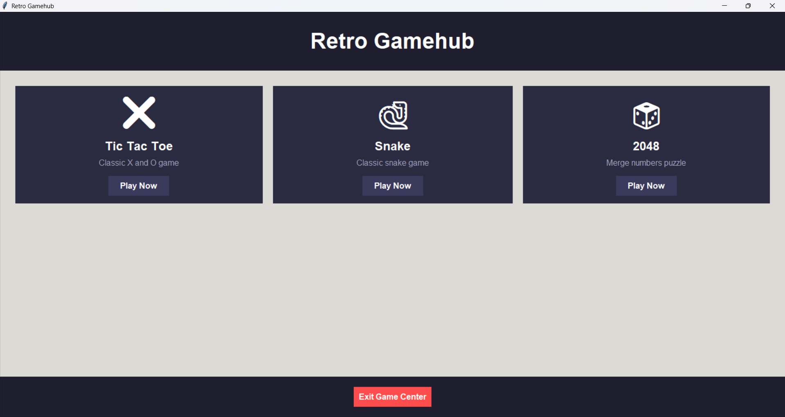
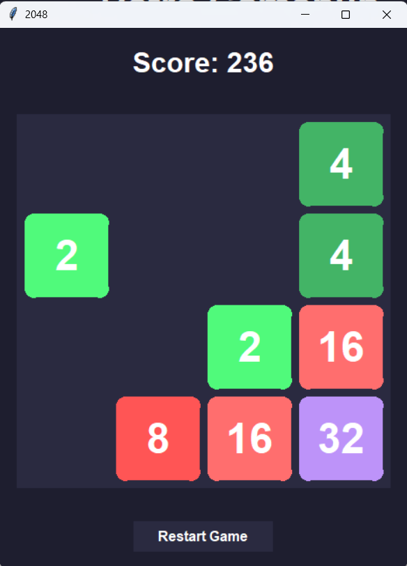
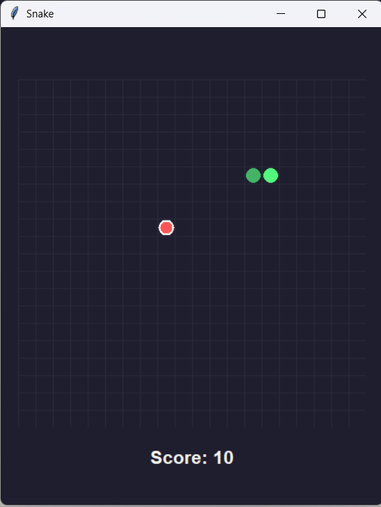

# Python Game Center 🎮

A modern collection of classic games built with Python and Tkinter, featuring a sleek dark theme interface.



## 🎯 Features

- Modern, dark-themed user interface
- Responsive design that adapts to different screen sizes
- Collection of classic games:
  - 🎲 2048
  - ❌ Tic Tac Toe
  - 🐍 Snake

## 🚀 Getting Started

### Prerequisites

- Python 3.6 or higher
- Tkinter (usually comes with Python)

### Installation

1. Clone the repository:
```bash
git clone https://github.com/Mehdirben/python_game_center.git
cd python_game_center
```

2. Run the game center:
```bash
python main.py
```

## 🎮 How to Play

### 2048
- Use arrow keys to slide tiles
- Combine matching numbers to reach 2048
- Game ends when no more moves are possible

### Tic Tac Toe
- Click on cells to place X or O
- Get three in a row to win
- Play against another player

### Snake
- Use arrow keys to control the snake
- Eat food to grow longer
- Avoid hitting walls and yourself

## 🎨 Features

- **Responsive Design**: Automatically adjusts to your screen size
- **Modern UI**: Sleek dark theme with smooth animations
- **Game State Management**: Save and resume functionality
- **Score Tracking**: Keep track of your high scores
- **Easy Navigation**: Simple menu system to switch between games

## 🛠️ Technical Details

- Built with Python 3.x
- Uses Tkinter for the GUI
- Object-oriented design with inheritance
- Modular architecture for easy game additions

## 🤝 Contributing

1. Fork the repository
2. Create your feature branch (`git checkout -b feature/AmazingFeature`)
3. Commit your changes (`git commit -m 'Add some AmazingFeature'`)
4. Push to the branch (`git push origin feature/AmazingFeature`)
5. Open a Pull Request

## 📝 License

Distributed under the MIT License. See `LICENSE` for more information.

## 🙏 Acknowledgments

- Inspired by classic arcade games
- Built with ❤️ using Python
- Thanks to all contributors and testers

## 📸 Screenshots

<details>
<summary>Click to expand</summary>





</details>
